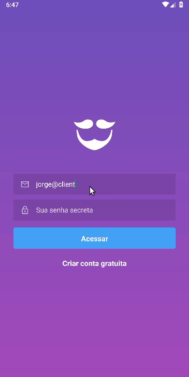

<h1 align="center">
  
  <br />
  <br />
  
</h1>

<h2 align="center">
  Desenvolvendo a aplicação mobile do GoBarber
</h2>

<h3 align="center"> Projeto desenvolvido na fase 05 do <a href="https://rocketseat.com.br/bootcamp">Bootcamp GoStack</a> 🎓</h3>

<h4 align="center">Interface mobile</h4>
<p align="center">
	</img>
</p>

## :page_facing_up: Índice

- [Sobre](#about)
- [Primeiros passos](#getting_started)
- [Feito com](#built_using)
- [Licença](#license)

## 🧐 Sobre <a name = "about"></a>

App de agendamento de serviços.

## 🏁 Primeiros passos <a name = "getting_started"></a>

Estas instruçōes te darão uma cópia funcional do projeto na sua máquina local para desenvolvimento e testes.
### Pré-requisitos

- JDK
- Android SDK
- React Native CLI
- [Rodar a aplicação backend](https://github.com/viniciusrodrigues1a/bootcamp-gostack-gobarber-api)

### Instalar as dependências

```sh
yarn install
```

### Rodando a aplicação:

#### Android:

```sh
react-native run-android
```

#### iOS:

```sh
react-native run-ios
```

#### Iniciando o app:

```sh
react-native start
```

## ⛏️ Feito com <a name = "built_using"></a>

- [ReactNative](https://reactnative.dev/) - Front-end framework
- [ReactNavigation](https://reactnavigation.org/) - Routing and navigation
- [Styled-Components](https://github.com/styled-components/styled-components) - CSS in JS library
- [Axios](https://github.com/axios/axios) - Promise based HTTP client
- [Date-fns](https://github.com/date-fns/date-fns) - Toolset for manipulating JavaScript dates
- [Immer](https://immerjs.github.io/immer/docs/introduction)
- [Prop-Types](https://github.com/facebook/prop-types)
- [React-native-vector-icons](https://github.com/oblador/react-native-vector-icons) - Icon toolset
- [Redux](https://redux.js.org/)
- [React-redux](https://react-redux.js.org/)
- [Redux-saga](https://redux-saga.js.org/)
- [Redux-persist](https://github.com/rt2zz/redux-persist)
- [Reactotron](https://github.com/infinitered/reactotron)

## :memo: Licença <a name = "license"></a>

Esse projeto está sob a licença MIT. Veja o arquivo [LICENSE](LICENSE) para mais detalhes.
